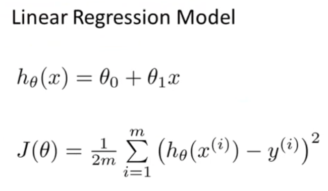
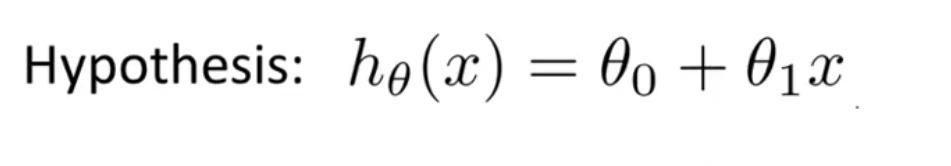
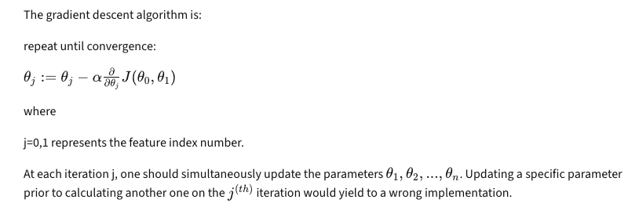

To predict continuous values: Supervised ML model -> Linear Regression:

Intuition of Linear Regression model h(x) and Loss function J(θ): 
    1. We have labelled input data (x)
    2. We use that data to come up with a hypothesis function (equation of a line: y = mx + C): 
      where θ1 = slope of the line and θ0 is the bias (y-intercept)
    3. We test the hypothesis function on the labelled test data
    4. After testing the function, we use Gradient Descent Algorithm to minimize the loss (Mean Squared Error) by updating the value of θ0 and θ1
    5. Formulae for Gradient Descent J(θ): 
    6. Once we reach the local minima, the values of θ0 and θ1 are finalized and then the hypothesis function is used to prediction of unlabelled continuous values (y)

